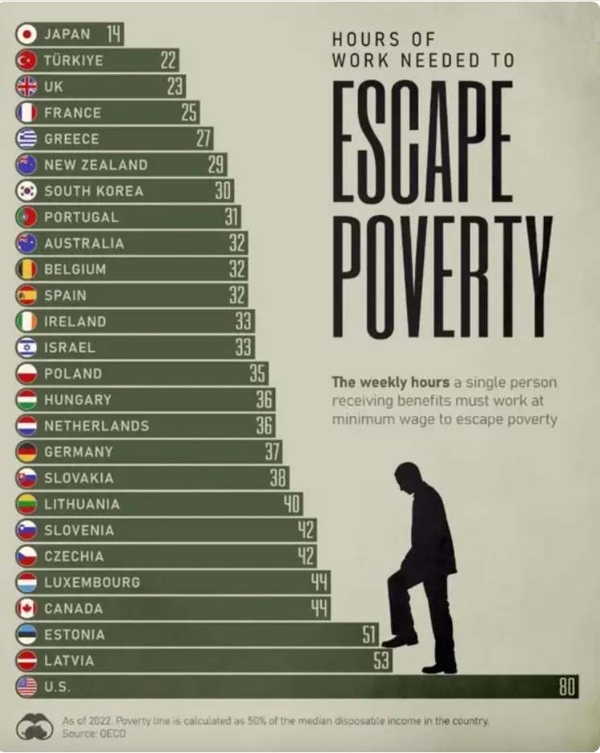
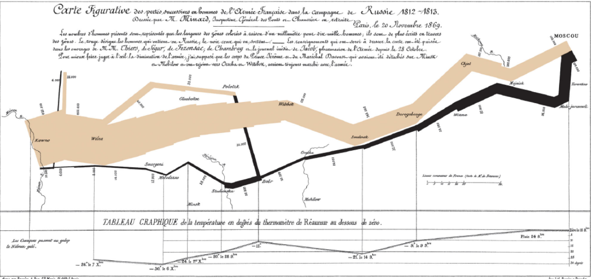
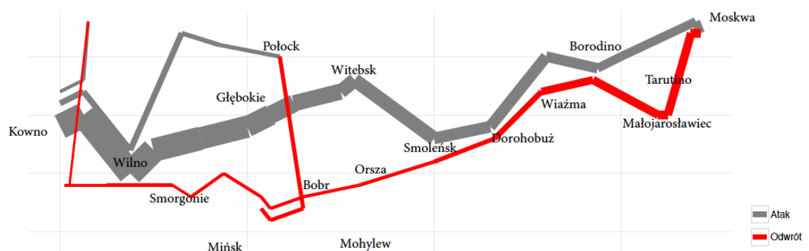
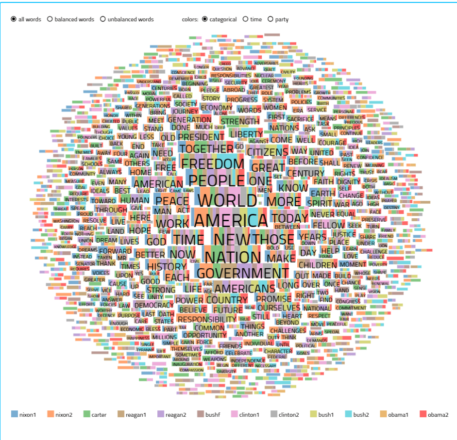
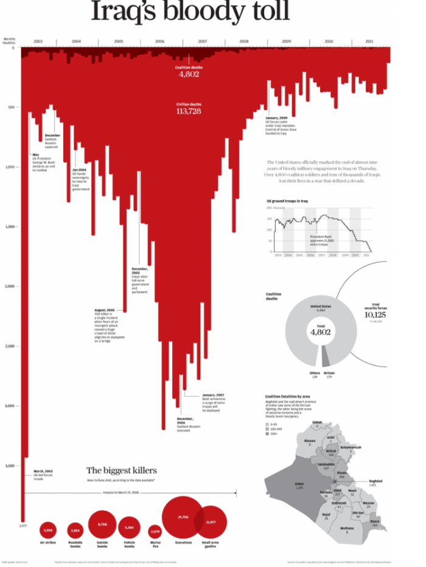
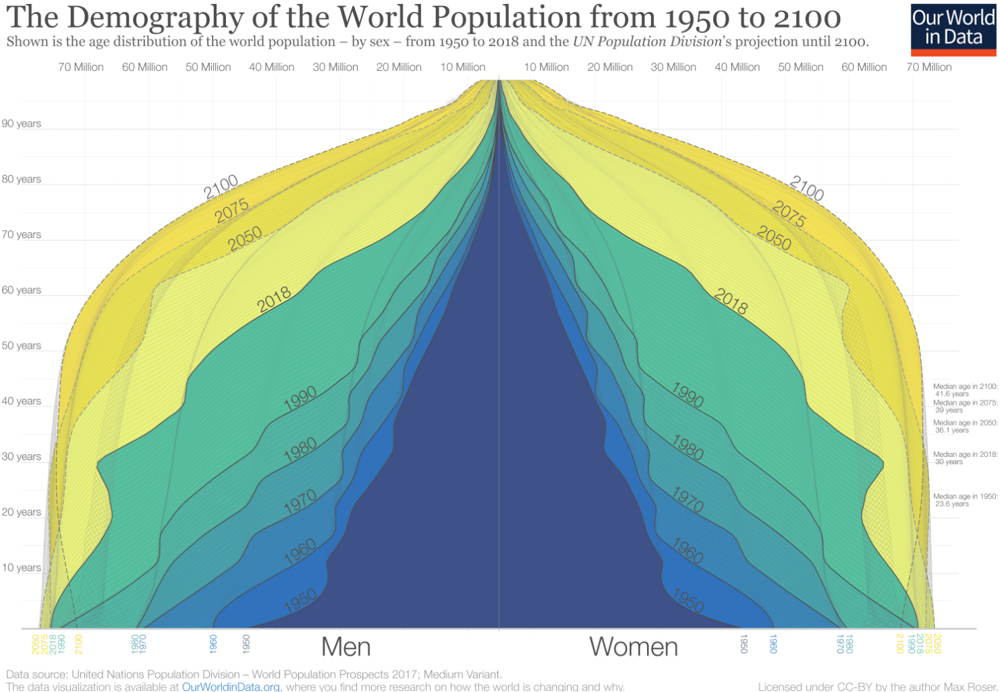

```{python}

import matplotlib.pyplot as plt
import numpy as np

# Konfiguracja danych [cite: 7, 8]
miesiace = ['Sty', 'Lut', 'Mar', 'Kwi', 'Maj', 'Cze', 'Lip', 'Sie', 'Wrz', 'Paź', 'Lis', 'Gru']
sprzedaz = [120, 135, 130, 145, 150, 140, 50, 40, 85, 115, 160, 200]

def stylizuj_wykres(ax, tytul):
    """Usuwanie szumu informacyjnego dla jasnego tła[cite: 108, 111, 115]."""
    ax.set_facecolor('white')
    ax.spines['top'].set_visible(False)
    ax.spines['right'].set_visible(False)
    ax.spines['left'].set_color('#d1d5db')
    ax.spines['bottom'].set_color('#d1d5db')
    ax.tick_params(colors='#4b5563')
    plt.title(tytul, fontsize=16, fontweight='bold', color='#111827', pad=20, loc='left')
    plt.ylabel('Sprzedaż (mln par)', color='#4b5563')

# KROK 1: Sytuacja - "Złota Era Komfortu" [cite: 36, 51]
fig1, ax1 = plt.subplots(figsize=(10, 5))
plt.plot(miesiace[:6], sprzedaz[:6], color='#9ca3af', marker='o', linewidth=3)
stylizuj_wykres(ax1, "KROK 1: ŚWIAT KOCHA KOMFORT (Sytuacja)")
plt.annotate('Ludzie przestają się wstydzić', xy=('Maj', 150), xytext=('Lut', 160),
             arrowprops=dict(arrowstyle='->', color='#9ca3af'))
plt.ylim(0, 220)

```

---
```{python}
import matplotlib.pyplot as plt
import numpy as np

# Konfiguracja danych [cite: 7, 8]
miesiace = ['Sty', 'Lut', 'Mar', 'Kwi', 'Maj', 'Cze', 'Lip', 'Sie', 'Wrz', 'Paź', 'Lis', 'Gru']
sprzedaz = [120, 135, 130, 145, 150, 140, 50, 40, 85, 115, 160, 200]

def stylizuj_wykres(ax, tytul):
    """Usuwanie szumu informacyjnego dla jasnego tła[cite: 108, 111, 115]."""
    ax.set_facecolor('white')
    ax.spines['top'].set_visible(False)
    ax.spines['right'].set_visible(False)
    ax.spines['left'].set_color('#d1d5db')
    ax.spines['bottom'].set_color('#d1d5db')
    ax.tick_params(colors='#4b5563')
    plt.title(tytul, fontsize=16, fontweight='bold', color='#111827', pad=20, loc='left')
    plt.ylabel('Sprzedaż (mln par)', color='#4b5563')

# KROK 1: Sytuacja - "Złota Era Komfortu" [cite: 36, 51]
fig1, ax1 = plt.subplots(figsize=(10, 4))
plt.plot(miesiace[:6], sprzedaz[:6], color='#9ca3af', marker='o', linewidth=3)
stylizuj_wykres(ax1, "KROK 1: ŚWIAT KOCHA KOMFORT (Sytuacja)")
plt.annotate('Ludzie przestają się wstydzić', xy=('Maj', 150), xytext=('Lut', 160),
             arrowprops=dict(arrowstyle='->', color='#9ca3af'))
plt.ylim(0, 220)
```

Czy wiesz, że... tempo wzrostu adopcji skarpetek do sandałów w pierwszym kwartale było o 25% wyższe niż tempo przyrostu użytkowników Netflixa w jego rekordowym roku? Gdybyśmy byli aplikacją, mielibyśmy więcej „pobrań” niż Threads w pierwszym tygodniu!

---

```{python}
# KROK 2: Komplikacja - "Wielki Nalot Policji Modowej" [cite: 39, 52]
fig2, ax2 = plt.subplots(figsize=(10, 5))
plt.plot(miesiace[:6], sprzedaz[:6], color='#d1d5db', marker='o', alpha=0.5)
plt.plot(miesiace[5:8], sprzedaz[5:8], color='#ef4444', marker='o', linewidth=5) # Kolor akcentu [cite: 126]
stylizuj_wykres(ax2, "KROK 2: INTERWENCJA POLICJI MODOWEJ (Kryzys!)")
plt.annotate('KRYZYS: Hejt na TikToku', xy=('Lip', 50), xytext=('Kwi', 20),
             color='#ef4444', fontweight='bold', arrowprops=dict(arrowstyle='->', color='#ef4444'))
plt.ylim(0, 220)

```

---
```{python}
# KROK 2: Komplikacja - "Wielki Nalot Policji Modowej" [cite: 39, 52]
fig2, ax2 = plt.subplots(figsize=(10, 4))
plt.plot(miesiace[:6], sprzedaz[:6], color='#d1d5db', marker='o', alpha=0.5)
plt.plot(miesiace[5:8], sprzedaz[5:8], color='#ef4444', marker='o', linewidth=5) # Kolor akcentu [cite: 126]
stylizuj_wykres(ax2, "KROK 2: INTERWENCJA POLICJI MODOWEJ (Kryzys!)")
plt.annotate('KRYZYS: Hejt na TikToku', xy=('Lip', 50), xytext=('Kwi', 20),
             color='#ef4444', fontweight='bold', arrowprops=dict(arrowstyle='->', color='#ef4444'))
plt.ylim(0, 220)

```

Skala katastrofy: Spadek przychodów w lipcu był bardziej bolesny niż słynny czarny czwartek dla Meta (Facebooka) w 2022 roku, kiedy firma straciła 232 miliardy dolarów wartości rynkowej w jeden dzień. Nasz „hejt na TikToku” był dla skarpetek tym, czym Cambridge Analytica dla Zuckerberga.

---

```{python}

fig3, ax3 = plt.subplots(figsize=(10, 5))
plt.plot(miesiace[:8], sprzedaz[:8], color='#d1d5db', marker='o', alpha=0.5)
plt.plot(miesiace[7:], sprzedaz[7:], color='#10b981', marker='o', linewidth=5, linestyle='--')
stylizuj_wykres(ax3, "KROK 3: REWOLUCJA 'SANDAŁO-SKARPETA' (Sukces!)")
plt.annotate('THE BIG IDEA: \nSkarpetka wszyta na stałe!', xy=('Paź', 115), xytext=('Cze', 180),
             color='#10b981', fontweight='bold', arrowprops=dict(arrowstyle='->', color='#10b981'))
plt.ylim(0, 220)

```

---

```{python}

fig3, ax3 = plt.subplots(figsize=(10, 4))
plt.plot(miesiace[:8], sprzedaz[:8], color='#d1d5db', marker='o', alpha=0.5)
plt.plot(miesiace[7:], sprzedaz[7:], color='#10b981', marker='o', linewidth=5, linestyle='--')
stylizuj_wykres(ax3, "KROK 3: REWOLUCJA 'SANDAŁO-SKARPETA' (Sukces!)")
plt.annotate('THE BIG IDEA: \nSkarpetka wszyta na stałe!', xy=('Paź', 115), xytext=('Cze', 180),
             color='#10b981', fontweight='bold', arrowprops=dict(arrowstyle='->', color='#10b981'))
plt.ylim(0, 220)

```

Efekt innowacji: Wprowadzenie „Sandało-Skarpety” (skarpetki wszytej na stałe) wygenerowało takie odbicie, że nasz wskaźnik konwersji stał się wyższy niż skuteczność algorytmu rekomendacji Amazon. Stworzyliśmy nową kategorię produktową – tak jak Apple tworząc iPada, gdy wszyscy twierdzili, że „nikt nie potrzebuje dużego iPhone'a bez funkcji dzwonienia”.

---

{height=700px}


---

Metafora wizualna jako główny nośnik emocji
Sylwetka człowieka wspinającego się po schodach to centralny element narracyjny. Schody = trud, wysiłek, mozół. Widz fizycznie rozumie przekaz zanim przeczyta jedną liczbę.

---




---




---

Technika: kontrast i tragedia
Grubość linii = liczba żołnierzy. Widz fizycznie odczuwa straty — linia szara (atak) jest masywna przy Kownie, czerwona (odwrót) — szczątkowa przy Moskwie. Storytelling działa tu przez wizualną metaforę: nie liczby, lecz kształt opowiada historię katastrofy.

---



---

Technika: porównanie w czasie
Każdy kolor to inna prezydentura. Rozmiar słowa = częstotliwość użycia. Widz może samodzielnie odkrywać wzorce — „AMERICA" dominuje u wszystkich, ale „GOVERNMENT" — u kogo?"

---


{height=600px}

---

Technika: oś czasu + kontekst wydarzeń
Słupki spadają w dół jak krople krwi — forma wizualna wzmacnia treść. Kluczowe zdarzenia (np. egzekucja Husajna, surge wojsk) są zakotwiczone na osi czasu jako punkty zwrotne narracji.

---



---

Technika: widok od zewnątrz do środka
Nakładające się warstwy lat tworzą efekt tunelu czasu. Widz rozumie trend globalny zanim przeczyta jedną liczbę. Symetria mężczyźni/kobiety to celowy wybór kompozycyjny.


