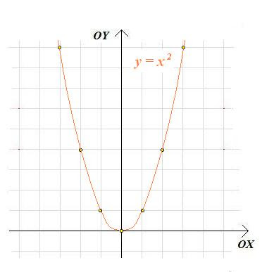
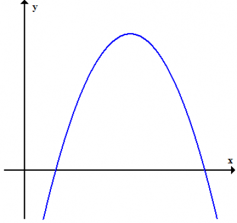

------------------------------------------------------------------------------------------------------
 
 

# Definicja 

Równanie kwadratowe to równanie w **postaci ogólnej**.
$$
\boxed {ax^{2}+bx-c=0,\qquad a\ne0 \quad b,c\in R \quad x\in R}
$$
 
gdzie $a,b,c$ to współczynniki liczbowe.
 
 
 
 

# Inne postacie równania kwadratowego

1. **Postać Iloczynowa**

$$
\boxed {a(x-x_{1})(x-x_{2})=0}
$$
- występuje, gdy są pierwiastki $x_{1}$ i $x_{2}$

2. **Postać kanoniczna**
$$
\boxed {a(x-p)^{2}+q=0}
$$

gdzie:
$$
\boxed {p = -\frac{b}{2a},\qquad q=-\frac{\Delta}{4}} 
$$

 
 
 
 

# Wykres równania kwadratowego
Wykresem funkcji jest parabola o wierzchołku w punkcie 
$$
\boxed {W=(p,q), \quad gdzie\quad p=-\frac{b}{2a},\qquad q=-\frac{\Delta}{4a}} 
$$

W zależności od $a$: 

1. Jeżeli $a > 0$, to ramiona paraboli są skierowane ku górze

2. Jeżeli $a < 0$, to ramiona paraboli są skierowane ku dołu

 
 
 
 

# Sposób rozwiązania 

1. Używamy delty $(\Delta)$.
$$
\boxed {\Delta = b^{2}-4ac}
$$
 

2. Liczba miejsc zerowych funkcji kwadratowej zależy od delty ($\Delta$):
 
 

* Jeżeli $\Delta > 0$, to funkcja kwadratowa ma **dwa różne miejsca zerowe**. 

$$
\boxed {x_1 = \frac{-b-\sqrt{\Delta}}{2a}\qquad x_2 = \frac{-b+\sqrt{\Delta}}{2a}}
$$

* Jeżeli $\Delta = 0$, to funkcja kwadratowa ma dokładnie **jedno miejsce zerowe**.

$$
\boxed {x_1=x_2=-\frac{b}{2a}}
$$

* Jeżeli $\Delta < 0$, to funkcja kwadratowa **nie ma rozwiązań.**  

 
 
 

# Przykłady
 
 
 

**a.**  Gdy nie ma rozwiązania ($\Delta < 0$)

$$
x^{2}+4x+5=0
$$

**Obliczenia:**

$$
\Delta = 4^{2}-4\cdot 1\cdot 5=16-20=-4
$$

 

**Komentarz:**

Ponieważ $\Delta < 0$, równanie **nie ma pierwiastków rzeczywistych.** Wykres funkcji kwadratowej **nie przecina osi OX**, lecz znajduje się całkowicie **powyżej** niej (ponieważ $a=1>0$).

 

**Opis słowny:**

Równanie nie ma rozwiązań w zbiorze liczb rzeczywistych, ale ma dwa rozwiązania zespolone. 

 
 
 
 

**b.**  Gdy jest jedno rozwiązanie ($\Delta = 0$)

$$
x^{2}+4x+4=0
$$

**Obliczenia:**
$$
\Delta = 4^{2}-4\cdot 1\cdot 4=16-16=0
$$

$$
x_1=x_2=-\frac{4}{2}=-2
$$

**Komentarz:**

Ponieważ $\Delta = 0$, równianie ma **jeden podwójny pierwiastek.** Wykres paraboli **styka się** z osią OX w jednym punkcie - w punkcie (-2,0).

 

**Opis słowny:**

Parabola ma wierzchołek dokładnie na osi OX, więc jest **styczna** do osi OX

 
 
 
 

**c.**  Gdy są dwa rozwiązania ($\Delta > 0$)

$$
x^{2}+7x-6=0 
$$

**Obliczenia:**

$$
\Delta = 7^{2}-4\cdot 1\cdot(-6)=49+24=73
$$

$$
\sqrt{\Delta} = \sqrt{73} \approx 8.54
$$

$$
x_1=\frac{-7-\sqrt{73}}{2}\approx-7.77, \qquad x_2=\frac{-7+\sqrt{73}}{2}\approx 0.77
$$

**Komentarz:**

Ponieważ $\Delta > 0$, równanie ma **dwa różne pierwiastki rzeczywiste.** Wykres paraboli **przecina oś OX w dwóch punktach.**

 

**Opis słowny:**

Parabola przechodzi przez oś OX w dwóch miejscach - ma dwa różne rozwiązania rzeczywiste równania kwadratowego. 

