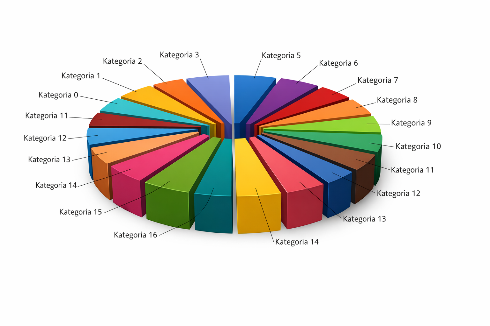
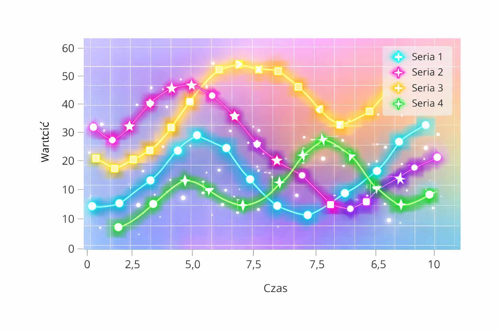
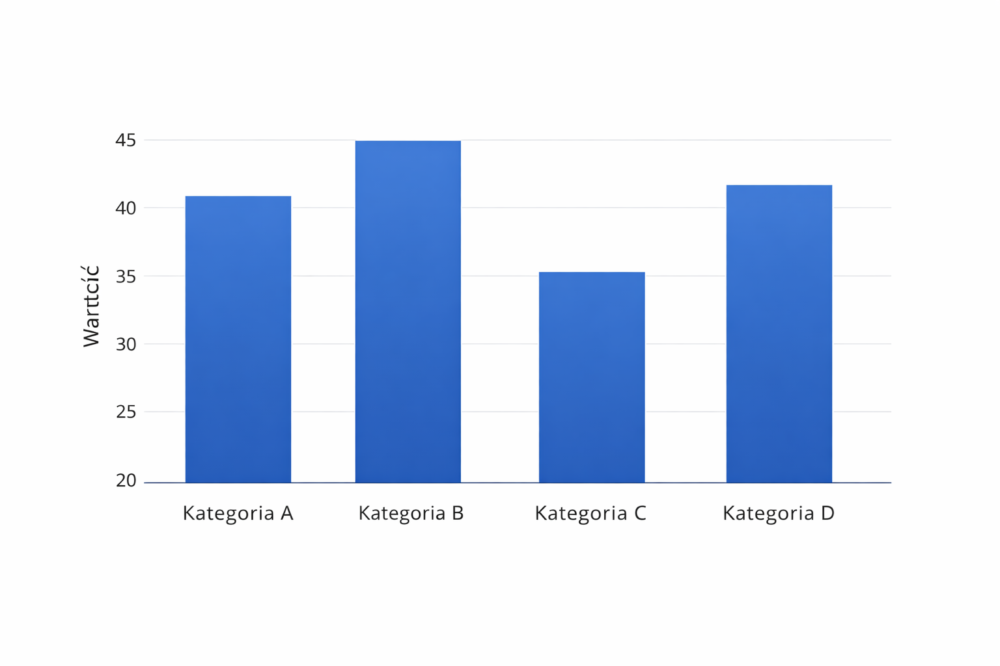

# Wprowadzenie 

W dzisiejszym świecie dostrzegamy i zauważamy liczne wykresy które urozmaicają różne
opracowania i raporty. Większość ludzi potrafi odróżnić wykresy kołowe od wykresów 
słupkowych a także potrafi odczytać najważniejsze informacje i wnioski wynikające z 
wykresów. Bardzo wiele osób nie zdaje sobie sprawy, że projektowanie wykresów jest 
ważnym procesem i nie łatwym procesem. Prawidłowy wykres to taki, który spełnia zasady 
Gestalta takie jak: bliskości, podobieństwa, domknięcia czy ciągłości. Taki wykres 
sprawia, że percepcja wizualna (czyli odbiór informacji wzrokowych) nie jest 
zniekształcony i pozwala lepiej interpretować barwy, światło, rozmiar figur 
znajdujących się na wykresie. W dalszej części znajdują się przykłady błędnych 
wizualiacji, które narusząją zasady Gestalta oraz przykłady poprawnych wizualicji. 


# Analiza błędnych wizualizacji

Cztery poniższe przykłady są wykonane w błędny sposób. Pod każdym wykresem znajduje się opis mówiący o błędach i naruszeniach zasad Gestalta.



Powyższy wykres jest niepoprawny pod względem wizualnym i prezentacji danych, ponieważ wykres jest w 3D, przez co dane mogą być zniekształcone. Nie możemy stwierdzić czy dana kategoria jest większa czy nie. Poza tym przerwy między danymi sprawiają, że mózg z automatu wypełnia luki między danymi. Dobór kolorów sprawia, że trudno nam odczytać dane. Ten wykres narusza zasadę podobieństwa i bliskości. 



Na pierwszy rzut oka wykres jest niepoprawny z powodu tła, który zaburza wizualny odczyt wykresu. Kolory linii wykresu się zlewają naruszając zasadę ciągłości. Błędem jest również źle zapisane słowo "wartość". Blask wokół linii działa na niekorzyść przy odczycie danych. Markery są niezgodne z legendą. Zasada bliskości została naruszona, gdyż np. przy analizie niebieskich markerów musisz oderwać swój wzrok i odczytać na etykiecie co oznacza.  



Wykres słupkowy został ukazany w błędny sposób, z powodu braku uporządkowania danych przez co utrudnia to odbiorcom znalezenie maksymalnej i minimalnej wartości danych. Wartości na tym wykresie zaczynają się od 20, co powoduje zaburzenie proporcji danych. Wykres narusza zasadę podobieństwa, gdyż wykres ma odcień gradientowy co oznacza, że wykresy nie są jendolite pod względem kolorystyki. Taka kolorystyka utrudnia nam odczyt danych. 

```{python}
#| echo: false

import pandas as pd
import matplotlib.pyplot as plt
import seaborn as sns


df_ludnosc = pd.read_csv('Liczba_ludności.csv', sep=';')
df_powierzchnia = pd.read_csv('Powierzchnia.csv', sep=';')
df_ludnosc.columns = ['Kod', 'Wojewodztwo', 'Ludnosc_Ogolem', 'Mezczyzni', 'Kobiety']
df_powierzchnia.columns = ['Kod', 'Wojewodztwo', 'Powierzchnia']
df = pd.merge(df_ludnosc, df_powierzchnia[['Wojewodztwo', 'Powierzchnia']], on='Wojewodztwo')
df['Gestosc'] = df['Ludnosc_Ogolem'] / df['Powierzchnia']
df['Wojewodztwo'] = df['Wojewodztwo'].str.capitalize()


df_long = df.melt(id_vars='Wojewodztwo', value_vars=['Mezczyzni', 'Kobiety'], 
                  var_name='Plec', value_name='Liczba')


plt.figure(figsize=(8, 8))
sns.lineplot(data=df_long, x='Plec', y='Liczba', hue='Wojewodztwo', marker='o', linewidth=2)
sns.set_palette("Greens_d", n_colors=16) 
plt.legend(bbox_to_anchor=(1.05, 1), loc='upper left', title='Województwa (Powodzenia w szukaniu!)', fontsize='small')
plt.grid(True, which='both', linestyle='-', linewidth=1, color='black', alpha=0.3)
plt.xticks(rotation=45) 
plt.ylabel('Liczba ludności ')
plt.xlabel('Płeć ')
plt.title('Chaos liniowy i naruszenie zasad Gestalt', fontsize=14, color='red')
plt.tight_layout()
plt.show()
```

Powyższy wykres, który został stworzony w języku python nie ułatwia nam percepcji wizualnej głównie przez to, że wykres w porównaniu do legendy jest wąski. Nazwy cech legendy nie są poprawne zapisane w języku polskim. Zasada ciągłości została naruszona z powodu liczny przecięć oraz zbędnego połączenia markerów. Kolorystyka markerów i lin sprawia, że kolory się zlewają utrudniając przypisanie danych do konkretnego województwa i naruszając zasadę podobieństwa. 

# Implementacja poprawnej wizualizacji

W tej części zostały przedstawione wykresy, które realizują poszczególną zasadę Gestalta i po redukcji „Data-Ink Ratio” , które ułatwiają odbiorcowi odczyt danych z wykresu. Wszystkie wykresy zostały stworzone na podstawie danych z Głównego Urzędu Statystycznego. Niektóre wykresy prezentują nam gęstość zaludnienia w poszczególnych województwach, która została wyliczona następującym wzorem:

$$
D = \frac{P}{A}
$$

Gdzie:

$D$ to gęstość zaludnienia $\frac{km^2}{os.}$

$P$ to całkowita liczba ludności ($Population$),

$A$ to powierzchnia województwa w $km^2$ ($Area$).


1. **Zasada Podobieństwa**

Jedną z ważniejszych zasad Gestalta jest ta mówiąca o podobieństwie. Mówi ona o tym, że elementy podobne wizualnie są postrzegane jako należąca do tej samej grupy. Poniższy wykres który został stworzony jako wykres punktowy realizuje tą zasadę.

```{python}
#| echo: false

import pandas as pd
import matplotlib.pyplot as plt
import seaborn as sns
import plotly.express as px


df_ludnosc = pd.read_csv('Liczba_ludności.csv', sep=';')
df_powierzchnia = pd.read_csv('Powierzchnia.csv', sep=';')

df_ludnosc.columns = ['Kod', 'Wojewodztwo', 'Ludnosc_Ogolem', 'Mezczyzni', 'Kobiety']
df_powierzchnia.columns = ['Kod', 'Wojewodztwo', 'Powierzchnia']

df = pd.merge(df_ludnosc, df_powierzchnia[['Wojewodztwo', 'Powierzchnia']], on='Wojewodztwo')
df['Gestosc'] = df['Ludnosc_Ogolem'] / df['Powierzchnia']
df['Wojewodztwo'] = df['Wojewodztwo'].str.capitalize()


plt.figure(figsize=(8, 6))
sns.scatterplot(data=df, x='Powierzchnia', y='Ludnosc_Ogolem', 
                hue='Wojewodztwo', s=100)
plt.title('Wykres 1: Relacja powierzchni do ludności')
plt.legend(bbox_to_anchor=(1.05, 1), loc='upper left')
plt.tight_layout()
plt.show()

```

Jak widzimy powyżej wykres spełnia zasadę podobieństwa, dlatego że elementy, które przedstawiają tę samą kategorię danych mają jednakową koloryrystykę i stal graficzny. Nie ma na tym wykresie gradientów i zbyt dużej ilości punktów, który by utrudniał odbiór danych. Poprzez to, że elementy wyglądają podobnie mózg może je grupować. 


2. **Zasada bliskości**

Kolejną ważną zasadą Gestalta jest ta mówiąca o bliskości i mówi o tym, że elementy znjadujące się blisko siebie są postrzegane jako takie, które należą do tej samej grupy. Poniższy wykres jest wykresem słupkowym.


```{python}
#| echo: false


plt.figure(figsize=(8, 6))
sns.barplot(data=df, x='Wojewodztwo', y='Gestosc', 
            hue='Wojewodztwo', palette='magma', legend=False)
plt.xticks(rotation=45)
plt.title('Wykres 2: Gęstość zaludnienia w województwach')
plt.tight_layout()
plt.show()

```

Jak widzimy powyżej słupki są blisko siebie, przez co łatwiej nam wyobrazić, że dane należą do jednej kategorii. Etykiety są blisko słupków oraz są pogrupowane przestrzennie. Nie musimy skakać między wykresem a legendą, gdyż legendy wogóle nie ma. 

3. **Redukcja „Data-Ink Ratio”**

Aby wykres nie posiadał zbędnych elementów trzeba przeprowadzić jeszcze redukcję "Data-Ink Ratio". Taki zabieg pozwala nam na usuniecię m.in gradientu, cieni i nadmiarowych linii siatek. Pozostawia się jedynie te dane niezbędne do odczytu danych. Poniżej mamy te wykresy, które pojawiły się we wcześniejszych częściach. 


```{python}
#| echo: false


fig = px.scatter(df, x="Powierzchnia", y="Ludnosc_Ogolem", size="Gestosc", 
                 color="Gestosc", hover_name="Wojewodztwo",
                 template="simple_white", title="Interaktywna analiza gęstości")
fig.show()
```


```{python}
#| echo: false


plt.figure(figsize=(8, 8))
df_sorted = df.sort_values('Gestosc', ascending=False)


ax4 = sns.barplot(data=df_sorted, x='Gestosc', y='Wojewodztwo', 
                  hue='Wojewodztwo', palette='Blues_r', legend=False)


sns.despine(left=True, bottom=True)
ax4.tick_params(axis='both', which='both', length=0) 
plt.xlabel('Osoby na km²')
plt.ylabel('') 
plt.title('Wykres 4: Ranking gęstości zaludnienia województw', pad=20)
plt.show()

```

# Wnioski

Analiza i poprawa efektywności wizualizacji zgodnie z psychologią percepcji jest kluczowym elementem skutecznego przekazywania informacji. Zasady Gestalta, takie jak podobieństwo, bliskość, domknięcie i ciągłość, odgrywają istotną rolę w projektowaniu wykresów, które są łatwe do zrozumienia i interpretacji. Poprawne zastosowanie tych zasad pozwala na lepszą percepcję wizualną, co z kolei ułatwia odbiorcom wyciąganie wniosków z danych. Redukcja „Data-Ink Ratio” jest również ważnym aspektem, który pomaga usunąć zbędne elementy i skupić uwagę na najważniejszych informacjach. W rezultacie, dobrze zaprojektowane wykresy mogą znacząco poprawić komunikację danych i wspierać podejmowanie decyzji opartych na faktach.


